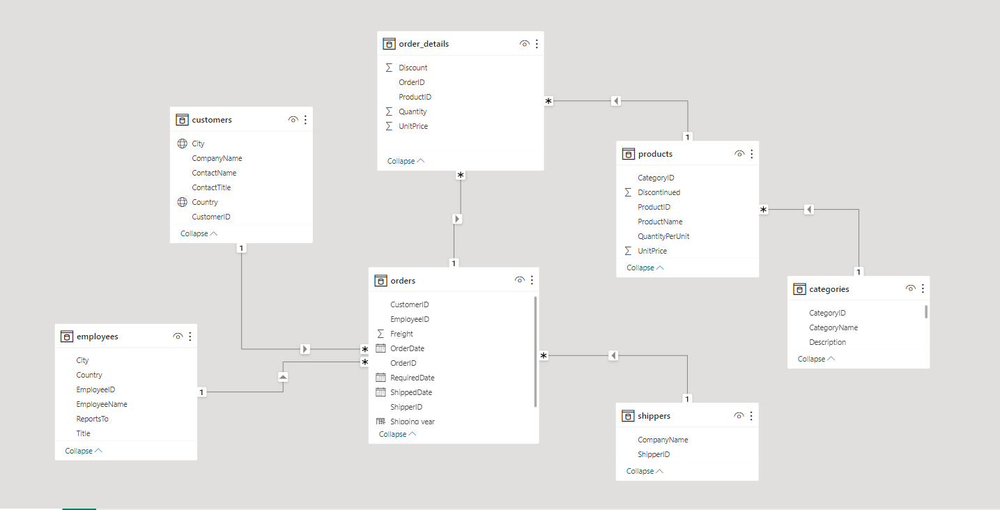

# Northwind Trades and Logistics

Picture Source: https://images.app.goo.gl/BtLj2RVTj76332448

## Introduction
This is a Microsoft Power BI project on Northwind Trading Company. An e-commerce and logistics company where innovation meets convenience in the world of online trading. They pride themselves on being at the forefront of the digital marketplace, offering a seamless platform for individuals and businesses to buy and sell goods with ease.

This project is aimed at analyzing the company’s yearly sales, shipping, customers, and employees’ data. This is done to evaluate the performance of the company and to make inference based on the data worked on. This will also help us make informed decisions, and ensure long-term sustainability and productivity. This process involves a comprehensive assessment of the company’s products, customers, employees, orders place and shipping companies used for logistics.

**_Disclaimer_** ⚠️- _All datasets and reports do not represent any real trading company or organization but just a dummy dataset to demonstrate my strengths and capacity with Microsoft Power BI._

For a more detailed view and interaction with the published project, [Click Here](https://app.powerbi.com/groups/me/reports/5bdf3ca6-d246-415d-8275-3c57a199025d/ReportSection012187e1caa116b044dd?experience=power-bi)

## Problem Statement
The primary goal of this analysis is to gain valuable insights into the operations of the Northwind Trading Company, yearly sales, shipping, customers, and employees’ data. To do these, we will be answering some specific questions using DAX functions. We would also be modeling all the tables to show their relationship, then display all visuals on our well-designed dashboard.

## Skills and Concepts Demonstrated
In this project, I explored most of Power BI’s functions. The following were used in this project: data cleaning using power query editor, DAX functions, visualization (column, bar, line, donut, pie charts, map, and slicers), calculated columns, conditional formatting and data modelling.

## Data Sourcing
The dataset was provided as an Excel CSV file, which was imported into our Power BI software. The dataset comprised of seven different tables that are inter-related with primary keys and foreign keys. The tables contain information about the company’s employees, customers, product categories, orders, and shipping details.

## Data Wrangling and Transformation
The data was imported and transformed using power query editor. The data was further examined for null values, duplicates and errors that may affect analysis. Null values in the date column were replaced with the day’s date and updated into our dataset.

## Data Modelling
The tables in the data were modelled based on their relationship. Dimension tables were linked to the fact tables using common columns as the primary keys and vice versa. The cardinality used was the many-to-one cardinality.

## Analysis and Visualization

1. The data was imported as stated above and then transformed using power query editor. The null values were replaced. Problematic data were all transformed. After successfully cleaning and replacing the null values, the tables are properly checked to confirm a thorough cleaning.

                                               |                                           
|----------------------------------------------------------------:|:---------------------------------------------------------------------------|

2. A calculated column was created for the date to extract the year for our DAX analysis. Although, this can be achieved without the creation of the year column. In Power BI, the date is broken down into days, month and year. The user can easily select any of the part of the date for the required analysis.

3. To calculate the the time taken to ship goods in days, we make use of the DAX function DATEDIFF. The column "Time taken to ship goods" was created for futher analysis and visualization.

<pre><code id="sqlQuery"> CODE:✍️
Time taken to Ship Goods = DATEDIFF(orders[OrderDate], orders[ShippedDate], DAY)
</code></pre><button class="btn" data-clipboard-target="#sqlQuery">

4. Two well curated dashboards were designed to display all key performance indicators and questions that were answered in the course of our analysis. These dashboards were done using well articulated charts and graphs to visualize the company's data for the different trading years. 

## Conclusion and Recommendation
- The project was a very interesting one and building the dashboard was even more interesting. From our analysis on the dashboards, we can see that the category of product that brought in the highest revenue is the beverage category which yielded $287,000 in revenue.
- It was also recorded as the category given the most discounts. The most sales of the company were made in the month of April and in the year 2014 with the least being recorded in the month of June.
- The Northwind customer base is seen to be scattered around the globe mostly in Europe and then South America and North America continents.
- Among the three shipping companies used, united package shipping was recorded with the highest freight and the mostly preferred by customers of the company.

Thank you for reading 🙏😃

